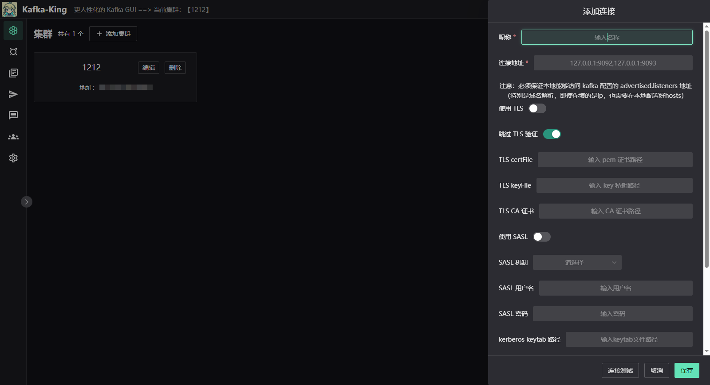
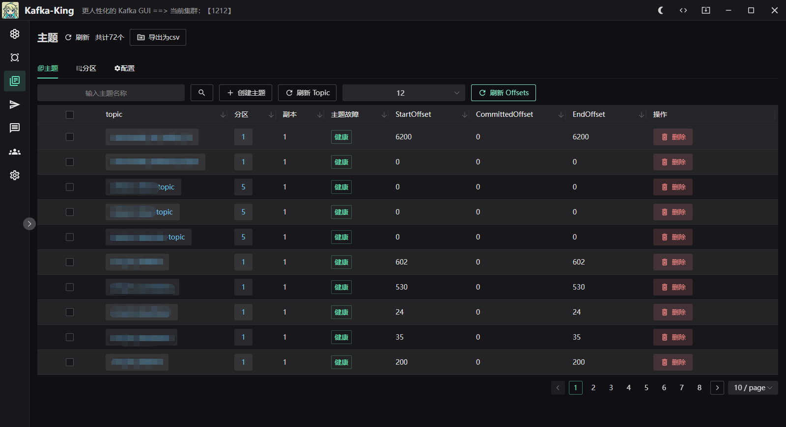
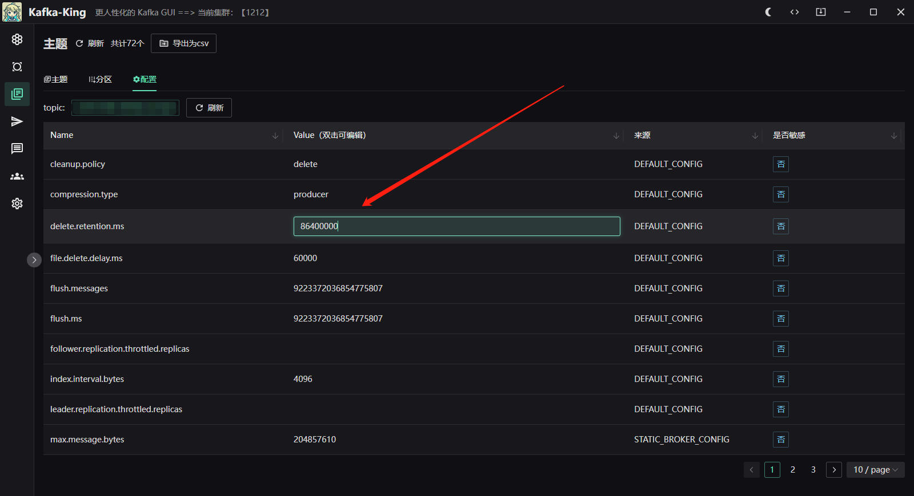
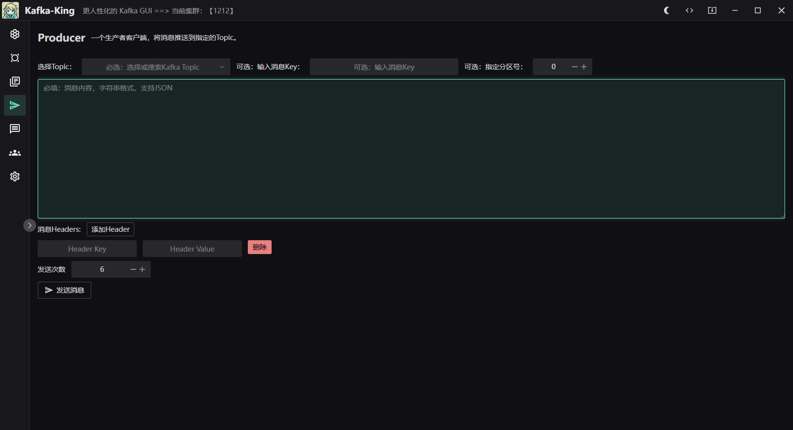
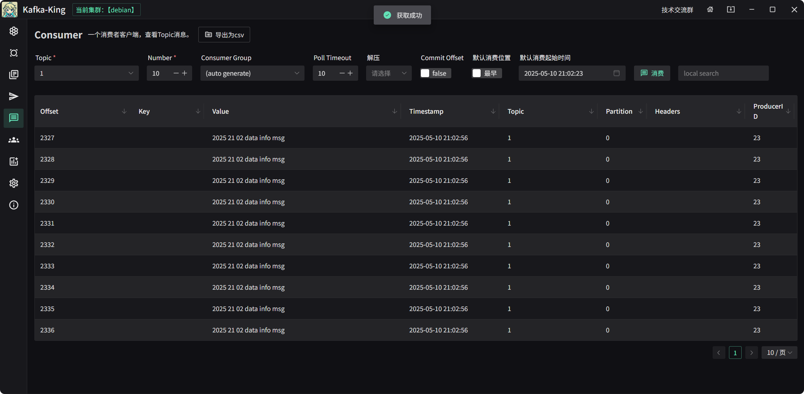

  

<h1 align="center">Kafka King </h1>

<h4 align="center"><strong>简体中文</strong> | <a href="https://github.com/Bronya0/Kafka-King/blob/wails/readme-en.md">English</a></h4>

<h3 align="center">A modern and practical kafka GUI client </h3>

<strong></strong>

This project is a kafka GUI client that supports various systems and is compact and easy to use.
Click a star to support the author's hard work in open source. Thank you❤❤

Join the group and communicate with the author: <a target="_blank" href="https://qm.qq.com/cgi-bin/qm/qr?k=pDqlVFyLMYEEw8DPJlRSBN27lF8qHV2v&jump_from= webapi&authKey=Wle/K0ARM1YQWlpn6vvfiZuMedy2tT9BI73mUvXVvCuktvi0fNfmNR19Jhyrf2Nz">R&D technical exchange group: 964440643</a>

Same elasticsearch client `ES-King`: https://github.com/Bronya0/ES-King

# Kafka-King function list
- [x] View the cluster node list, support dynamic configuration of broker and topic configuration items!
- [x] Supports consumer clients, consumes the specified topic, size, and timeout according to the specified group, and displays the message information in various dimensions in a table!
- [x] Supports PLAIN, SSL, SASL, kerberos, sasl_plaintext, etc. etc. 
- [x] Create topics (support batches), delete topics, specify replicas, partitions
- [x] Support statistics of the total number of messages, total number of submissions, and backlog for each topic based on consumer groups
- [x] Support viewing topics Detailed information (offset) of the partition, and support adding additional partitions
- [x] Support simulated producers, batch sending messages, specify headers, partitions
- [x] Health check (completed)
- [x] Support viewing consumer groups , Consumer- ……

# Download
on the right, or click [Download address](https://github.com/Bronya0/Kafka-King/releases), expand [Assets], select your own platform to download, supports windows, macos, linux.

> Tips: Please check the `advertised.listeners` configured in the kafka cluster before use. If the configuration is a domain name, then when filling in the connection address in King, please add the corresponding domain name resolution in the hosts file of the local computer in advance, otherwise it will be due to Unable to resolve domain name and unable to connect# Functional 

# screenshot

# Quickly start
by selecting the corresponding version in Assets under release on the right to download.
Or click https://github.com/Bronya0/Kafka-King/releases

# Build
only if you want to study the source code. You need to manually build pip install -r requirements.txt

flet pack main.py -i assets/icon.ico -n kafka- king --add-data=assets/*:assets --product-name kafka-king

# Star

# License
Apache- 2.0 license

# Thanks
- wails：https://wails.io/docs/gettingstarted/installation
- naive ui：https://www.naiveui.com/
- kafka-python：https://github.com/twmb/franz-go/
