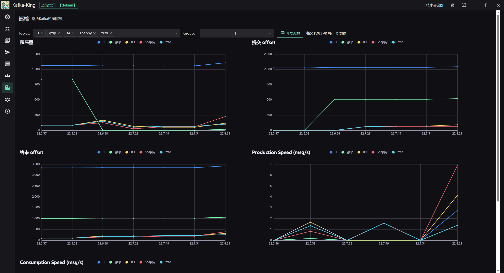

<p align="center">
  
</p>
<h1 align="center">Kafka King </h1>

<div align="center">
  


<h3 align="center">A modern, practical Kafka GUI client </h3>

</div>
<h4 align="center">
English | <a href="README-CN.md">简体中文</a> | <a href="docs/readme/readme-ja.md">日本語</a> |  <a href="docs/readme/readme-ru.md">рускі</a> | <a href="docs/readme/readme-ko.md">한국인</a>  
</h4>


This project is a kafka GUI client, adapted to various desktop systems (except Win7), supports kafka 0.8.0 to 3.8+ ，Based on [Wails](https://github.com/wailsapp/wails) and [franz-go](https://github.com/twmb/franz-go).

 A similarly powerful Elasticsearch client `ES-King` : https://github.com/Bronya0/ES-King

 AI Doc：[https://zread.ai/Bronya0/Kafka-King](https://zread.ai/Bronya0/Kafka-King)


# Features of Kafka-King
- [x] View the list of cluster nodes, dynamically configure broker and topic settings.
- [x] Support for consumer clients to consume messages from specified topics with group, size, and timeout parameters, displaying message details in tabular form.
- [x] Support for PLAIN, SSL, SASL, Kerberos, sasl_plaintext, etc.
- [x] Support gzip、lz4、snappy、zstd compress and decompress
- [x] Create (supports batch operations) and delete topics, specifying replicas and partitions.
- [x] Statistics on each topic's total message count, committed offset, and lag for each consumer group.
- [x] Detailed information about topic partitions (offsets), with support for adding additional partitions.
- [x] Simulate producer behavior, send messages in batches with headers and partition specifications.
- [x] Topic and partition health checks (completed).
- [x] View consumer groups and individual consumers.
- [x] Offset inspection reports.

# Download
Download from the right side or visit the [release page](https://github.com/Bronya0/Kafka-King/releases). Expand 【Assets】and choose the version suitable for your platform, supporting Windows, macOS, Linux.

`Important Notes:`

1. **Before using, ensure that the `advertised.listeners` setting of your Kafka cluster is correctly configured. If not configured or if domain names are used, add corresponding domain name resolution entries in the hosts file of your local machine to avoid connection issues due to unresolved domain names, even when IP addresses are entered in King.**
2. **If your connection requires SSL, enable TLS and ignore verification unless you have a certificate, in which case enable TLS verification and provide the certificate path.**
3. **SASL users should enable SASL and select the appropriate SASL protocol (usually plain), then enter the username and password.**
4. **In case of webview2 runtime errors, download and reinstall the runtime from Microsoft's official website: https://developer.microsoft.com/en-us/microsoft-edge/webview2**

# Screenshots
Offset inspection feature introduced in v0.33 offers an intuitive view of message backlog.

Topic list with various operation options.

Message viewing interface.


# Participate in development
Install golang, node.js, npm, and run `go install github.com/wailsapp/wails/v2/cmd/wails@latest` to install Wails CLI.
```
cd app
wails dev
```

# License
Apache-2.0 license

# Acknowledgements
- wails: https://wails.io/docs/gettingstarted/installation
- naive ui: https://www.naiveui.com/
- franz-go: https://github.com/twmb/franz-go/
- xicons: https://xicons.org/#/

# TransLate
Support Chinese, Japanese, English, Korean, Russian and other languages

Fix or add new language：https://github.com/Bronya0/Kafka-King/issues/51

# Star
[](https://starchart.cc/Bronya0/Kafka-King)

## MY Project 我的项目 

| 项目名称 | 描述 | Star & Download |
| --- | --- | --- |
| [**Kafka-King**](https://github.com/Bronya0/Kafka-King) | 一个现代且实用的Kafka GUI客户端 | [](https://github.com/Bronya0/Kafka-King) [](https://github.com/Bronya0/Kafka-King/releases) |
| [**ES-King**](https://github.com/Bronya0/ES-King) | 一个现代、实用的Elasticsearch本地客户端 | [](https://github.com/Bronya0/ES-King) [](https://github.com/Bronya0/ES-King/releases) |
| [**Tab-King**](https://github.com/Bronya0/Tab-King) | 功能强大的浏览器自定义新标签页扩展 | [edge商店](https://microsoftedge.microsoft.com/addons/detail/tab-king/gjfaiiokimilnlmifafjhhcmjeakmmdf) | [](https://github.com/Bronya0/Tab-King) [](https://github.com/Bronya0/Tab-King/releases)
| [**epub-merge**](https://github.com/Bronya0/epub-merge) | epub合并工具 | [](https://github.com/Bronya0/epub-merge) [](https://github.com/Bronya0/epub-merge/releases) |
| [**typora-theme-bronya**](https://github.com/Bronya0/typora-theme-bronya) | 一个名为bronya的Typora主题 | [](https://github.com/Bronya0/typora-theme-bronya) [](https://github.com/Bronya0/typora-theme-bronya/releases) |
| [**webp-to-jpg**](https://github.com/Bronya0/webp-to-jpg) | 将webp图片转换为jpeg格式 | [](https://github.com/Bronya0/webp-to-jpg) [](https://github.com/Bronya0/webp-to-jpg/releases) |
| [**web-starter**](https://github.com/Bronya0/web-starter) | Golang Web项目脚手架 | [](https://github.com/Bronya0/web-starter) |
| [**go-utils**](https://github.com/Bronya0/go-utils) | 提供Golang中安全、高效的操作函数 | [](https://github.com/Bronya0/go-utils) |
| [**django-onii**](https://github.com/Bronya0/django-onii) | 基于Python Django+DRF的脚手架 | [](https://github.com/Bronya0/django-onii) |
| [**Jetbrains-Darcula-Zed-Theme**](https://github.com/Bronya0/Jetbrains-Darcula-Zed-Theme) | 仿Jetbrains Zed的Darcula主题 | [](https://github.com/Bronya0/Jetbrains-Darcula-Zed-Theme) |
