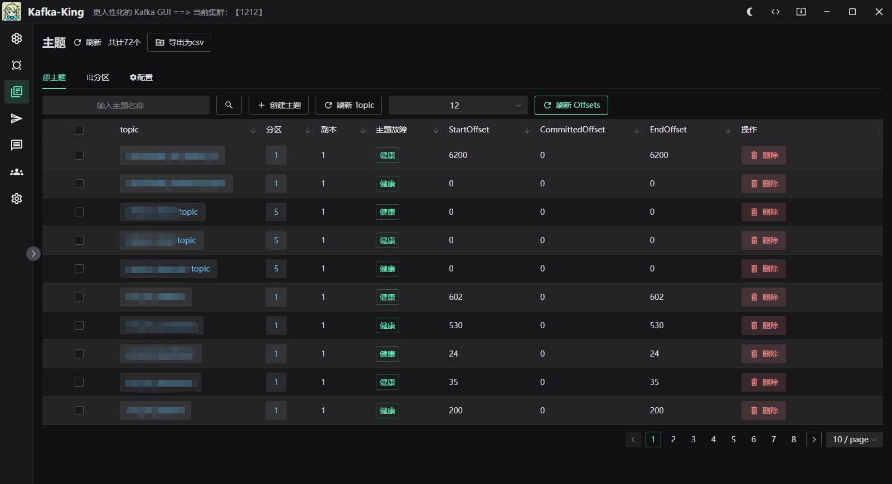

  

<h1 align="center">Kafka King </h1>

<h4 align="center"><strong>简体中文</strong> | <a href="https://github.com/Bronya0/Kafka-King/blob/main/docs/README_EN.md">English</a></h4>

<h3 align="center">一个现代、实用的kafka GUI客户端 </h3>

<strong></strong>

本项目是一个kafka GUI客户端，支持各个系统，小巧好用。
点个star支持作者辛苦开源吧 谢谢❤❤

加群和作者一起交流： <a target="_blank" href="https://qm.qq.com/cgi-bin/qm/qr?k=pDqlVFyLMYEEw8DPJlRSBN27lF8qHV2v&jump_from=webapi&authKey=Wle/K0ARM1YQWlpn6vvfiZuMedy2tT9BI73mUvXVvCuktvi0fNfmNR19Jhyrf2Nz">研发技术交流群：964440643</a>

同款elasticsearch客户端 `ES-King` ：https://github.com/Bronya0/ES-King

# Kafka-King功能清单
- [x] 查看集群节点列表，支持动态配置broker、topic的配置项！
- [x] 支持消费者客户端，按照指定的group进行指定topic、size、timeout的消费，以表格的形式展示消息的各个维度信息！
- [x] 支持PLAIN、SSL、SASL、kerberos、sasl_plaintext等等
- [x] 创建主题（支持批量）、删除主题，指定副本、分区
- [x] 支持根据消费者组统计每个topic的消息总量、提交总量、积压量
- [x] 支持查看topic的分区的详细信息（offset），并支持添加额外的分区
- [x] 支持模拟生产者，批量发送消息，指定headers、分区
- [x] 健康检查（完成）
- [x] 支持查看消费者组、消费者
- ……

# 下载
右侧下载，或者点[下载地址](https://github.com/Bronya0/Kafka-King/releases)，展开【Assets】，选择自己的平台下载，支持windows、macos、linux。

> 小提示：使用前请检查kafka集群配置的`advertised.listeners`，如果配置是域名，那么在King中填写连接地址时，请提前在本机电脑的hosts文件中添加对应域名解析，否则会因为无法解析域名而无法连接

# 功能截图

# 快速开始
在右侧release下的Assets选择对应版本下载即可。
或者点击 https://github.com/Bronya0/Kafka-King/releases

# 构建
只有要研究源码才需要手动构建

pip install -r requirements.txt

flet pack main.py -i assets/icon.ico  -n kafka-king --add-data=assets/*:assets --product-name kafka-king

## QQ交流群
<a target="_blank" href="https://qm.qq.com/cgi-bin/qm/qr?k=pDqlVFyLMYEEw8DPJlRSBN27lF8qHV2v&jump_from=webapi&authKey=Wle/K0ARM1YQWlpn6vvfiZuMedy2tT9BI73mUvXVvCuktvi0fNfmNR19Jhyrf2Nz">KingTool研发技术交流群：964440643</a>

# Star星星

# License
Apache-2.0 license

# 感谢
- wails：https://wails.io/docs/gettingstarted/installation
- naive ui：https://www.naiveui.com/
- kafka-python：https://github.com/twmb/franz-go/
